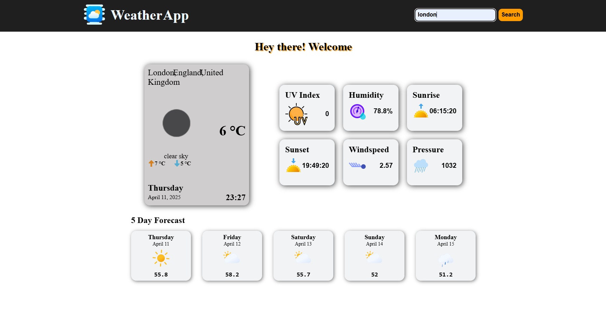
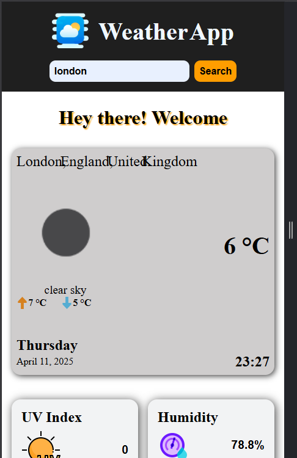
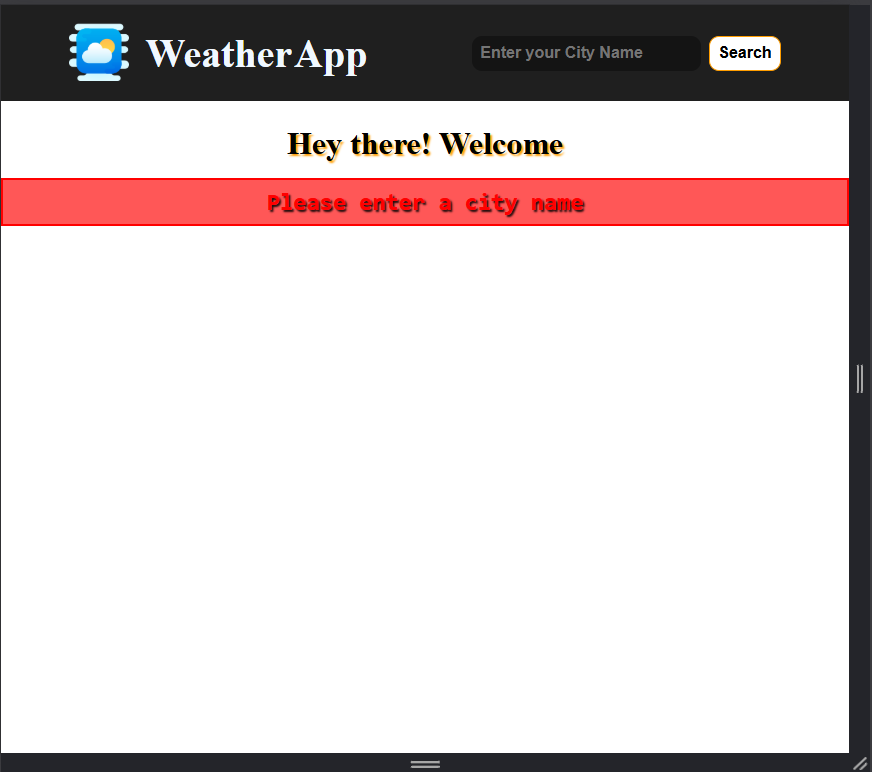
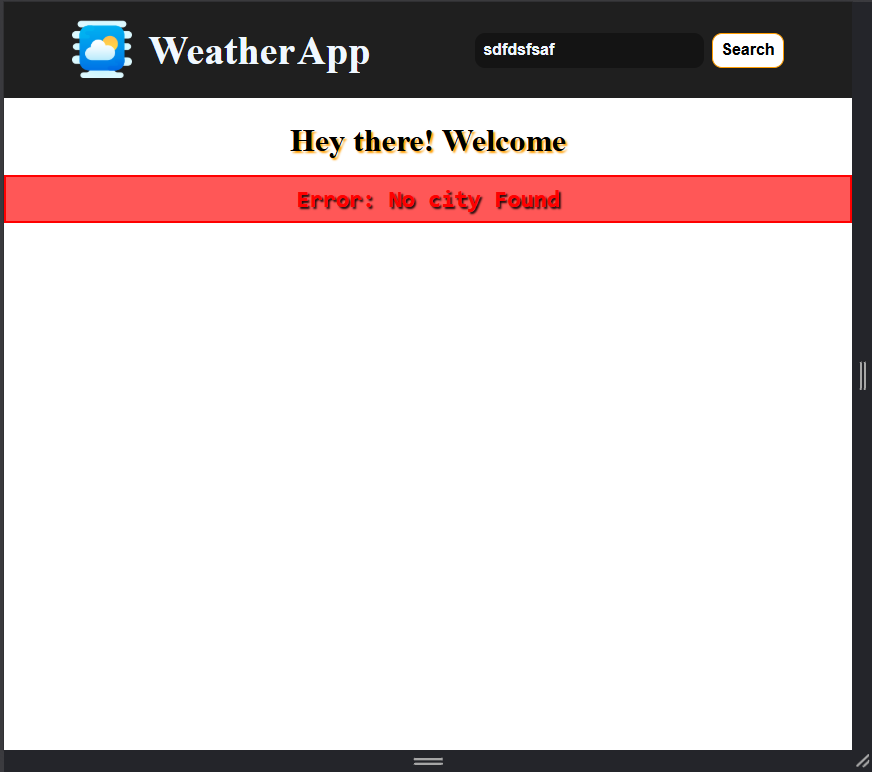

# ⛅Weather App
Ce projet est réalisé dans le cadre du parcours Full Stack Developer de [The Odin Project](hhttps://www.theodinproject.com/lessons/node-path-javascript-weather-app). Il s'agit d'une simple application météo construite avec **HTML**, **CSS** et **JavaScript**. Elle permet d’obtenir en temps réel la météo actuelle d'une ville grâce à l’API **OpenWeatherMap** et **Visual Crossing Weather**.

## 🌐Démo

Démo ici: [Live](https://lil-code30.github.io/weather_app/)

## 🚀 Fonctionnalités

- Recherche météo par ville
- Température actuelle (°C)
- Humidité
- Vitesse du vent
- Icône météo dynamique
- Interface responsive et minimaliste
  
## 🔑 Obtenir ta clé API
Crée un compte sur [OpenWeatherMap API](https://openweathermap.org/api) ou [Visual Crossing Weather API](https://www.visualcrossing.com/weather-api/).
Va dans API keys et copie ta clé.

La clé API est déjà incluse dans le fichier `script.js` pour faciliter les tests.  

```javascript
const url = `https://api.openweathermap.org/data/2.5/weather?q=${city}&appid=TA_CLE_ICI`;
```

## 🖼️ Aperçu
<div align="center">
<p><em> Aperçu du projet</em></p>
  <br><br>
  <br>
  <br><br>
  <br>
  
</div>

## 🔧 Technologies utilisées
- HTML5
- CSS3
- JavaScript (Vanilla)
- [OpenWeatherMap API](https://openweathermap.org/api)
- [Visual Crossing Weather API](https://www.visualcrossing.com/weather-api/)

## 📦 Installation locale

1. Clone le dépôt :

```bash
git clone https://github.com/Lil-Code30/weather_app.git
````
2. Accède au dossier :
```bash
cd weather_app
```
3. Ouvre ``index.html`` dans ton navigateur :
```bash
open index.html
```
